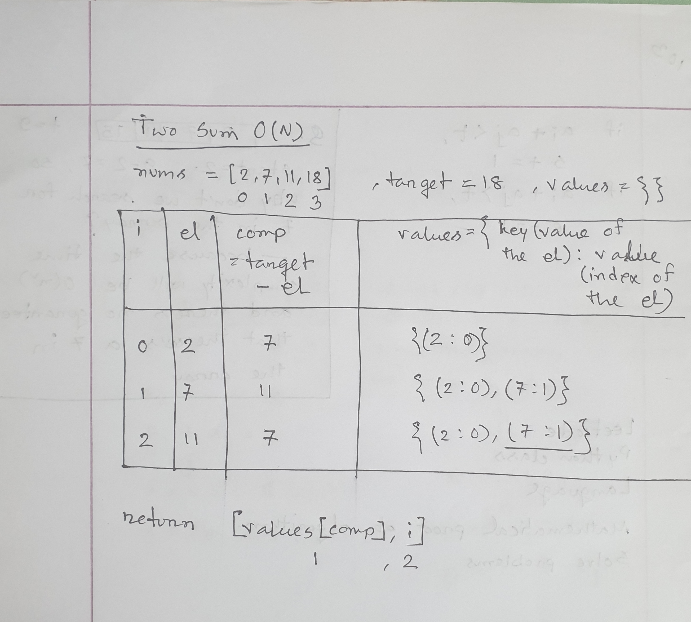

# Class 1

### List in Python
Lists in Python work like arrays. It's a built in data type and can be declared like this.
```python
list1 = [] 
list2 = [1,2,3]
```
The items in a list are ordered, changable and they allow duplicate values.

The methods that we can use with List are - 
 - **append()** - adding an item to the list.
    ```
    list.append(item)
    ```
 - **extend()** - extending the list by appending all the items from another iterable at the end of the list.
    ```python
    list1 = [1,2,3]
    list2 = [4,5,6]
    list1.extend(list2)
    ```
 - **insert()** - inserting an item in a given position.
    ```
    list.insert(position,item)
    ```
 - **remove()** - removing an item from the list using its value.
    ```
    list.remove(item)
    ```
 - **pop()** - removing an item at a given position in the list. If no index specified, then the last item is removed from the list.
    ```
    list.pop(position)
    ```
 - **clear()** - removing all items from a list.
 - **index()** - searching for an item in the list and returning its index.
   ```
   list.index(item, start(optional), end(optional))
   ```
 - **count()** - counting the number of times an item appears in the list.
   ```
   list.count(item)
   ```
 - **sort()** - sorting the list in acsending or descending order.
   ```python
   list1.sort()
   list2.sort(reverse=True)
   ```
 - **reverse()** - reversing the items in a list.
 - **copy()** - making a copy of the list by not changing the original list.
   ```
   list2 = list1.copy()
   ```

### Dictionary
Dictionary is a built in data type in python to store collections. Items are stored as key:value pairs here, so dictionaries take less time but more space.

A dictionary can be declared like this. The value is accessed by its key.
```python
values1 = {}
values2 = {"key1":"value1", "key2":"value2"}
```
The built-in methods for dictionary are - 
 - **clear()** - removes all elements from the dictionary.
 - **copy()** - returns a copy of the dictionary.
   ```python
   dictionary1 = {1:'one', 2:'two'}
   dictionary2 = dictionary1.copy()
   ```
 - **fromkeys()** - returns a dictionary with the specified keys and value.
   ```python
   x = ('key1', 'key2', 'key3')
   y = 0
   dictionary1 = dict.fromkeys(x, y)
   ```
 - **get()** - returns the value of the specified key.
   ```
   dictionary.get(key)
   ```
 - **items()** - returns a list containing a tuple for each key value pair.
 - **keys()** - returns a list containing the keys of the dictionary.
 - **pop()** - removes the element with the specified key.
   ```
   dictionary.pop(key)
   ```
 - **popitem()** - removes the last inserted key-value pair from the dictionary.
 - **setdefault()** - returns the value of the specified key or if it doesn't exist, inserts the key with the specified value.
   ```
   dictionary.setdefault(key, value)
   ```
 - **update** - updates the dictionary with the specified key-value pairs.
   ```
   dictionary.update({key:value})
   ```
 - **values()** - returns a list of all the values in the dictionary.

### Time Complexity
Time complexity is the number of operations a computer needs to perform in order to run a program. The common metric for calculating this is the Big O Notation.
It gives us the maximum number of operations needed to run a program.

#### How to calculate time complexity
 - **Sequential Statements** - For statements that perform 1 operation at a time, the time complexity is constant or **O(1)**. O(1) describes algorithms that take the same amount of time to compute regardless of the input size.
 > T(n) = t(statement1) + t(statement2) + ... + t(statementN);
 - **Conditional Statements** - The complexity will be the highest number of operation that was done in a conditional statement.
 > T(n) = Math.max([t(statement1) + t(statement2)], [time(statement3)])
 - **Loop Statements**
   - **Linear Time Loops** - The comlexity will be the number of times the loop repeats multiplied by the time complexity of the statements inside. So if the loop repeats n times, the complexity will be **O(n)**.
   > T(n) = n * [ t(statement1) + t(statement2) ]
   - **Constant-Time Loops** - But if the loop always repeats for a constant number of time, the complexity is constant.
   - **Logarithmic Time Loops** - The complexity of a loop will be **O(log n)** if the loop variables is divided / multiplied by a constant amount.
 - **Nested loops statements** - For nested loops, the complexity will be the multiplied value of the number of iterations of each loop. So if each loop runs n times, the complexity will be O(n<sup>number of loops</sup>).
   > T(n) = n * [t(statement1) + m * t(statement2...3)]

These are some of the most common time complexities.


#### Why is looping over range() faster than while loop in python
This happens because for running a while loop, the python byte code does 10 operations but for running a for loop in range, it does only 3 operations. 

### Space Complexity
Space complexity is the total amount of memory space used by an algorithm/program including the space of input values for execution. It's generally constant if the program doesn't contain any loops, but if it does then the complexity is linear **O(n)**.

## Class 1 Lecture


