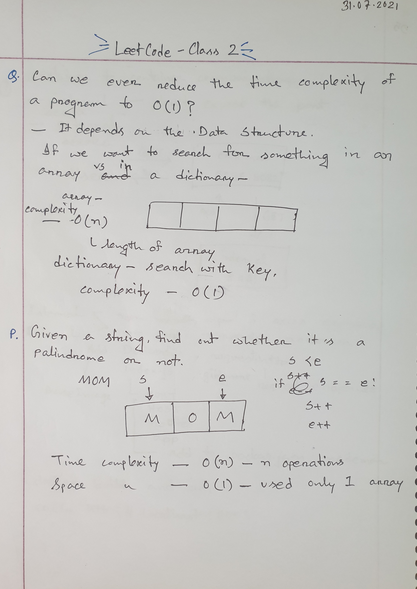
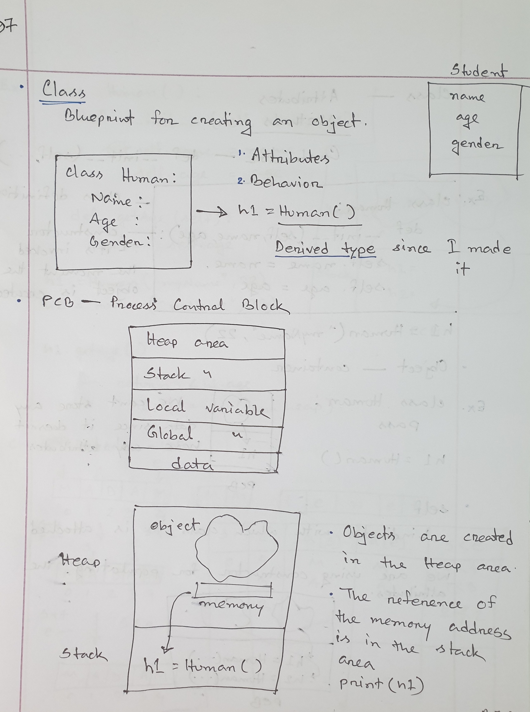
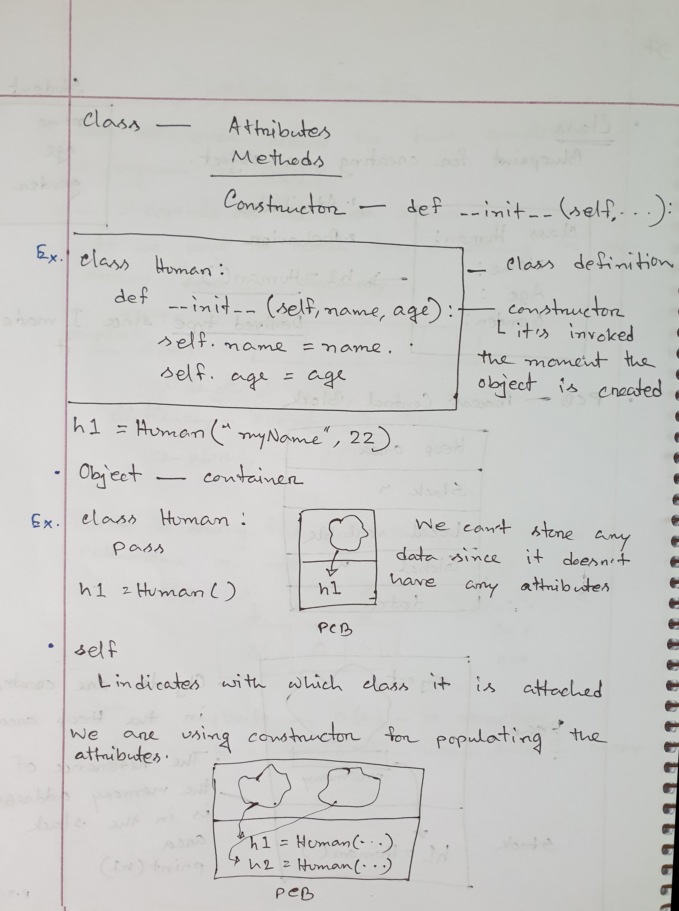
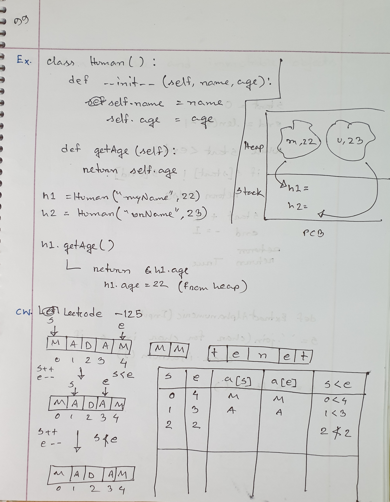
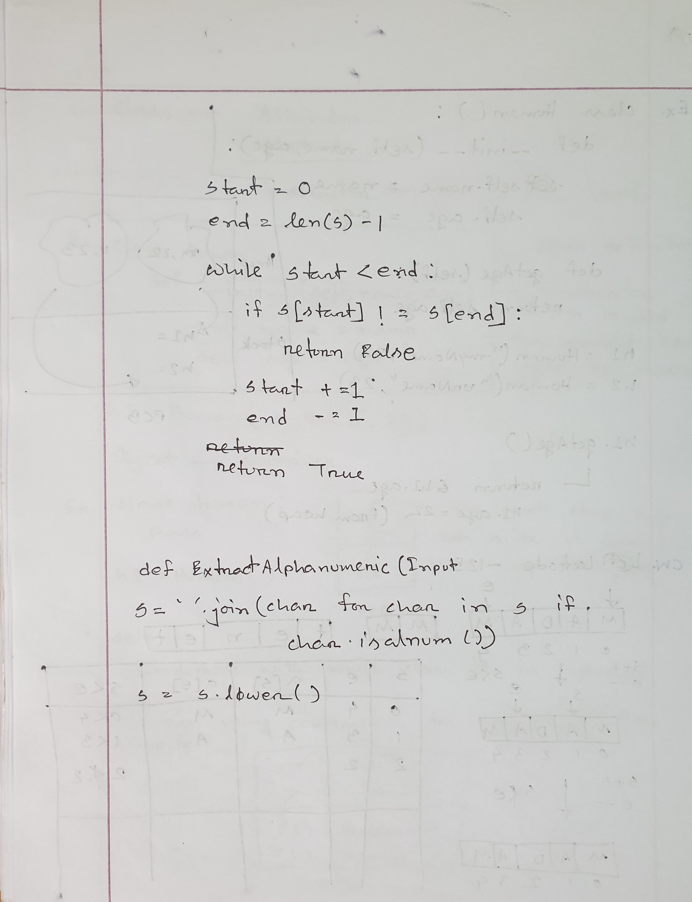
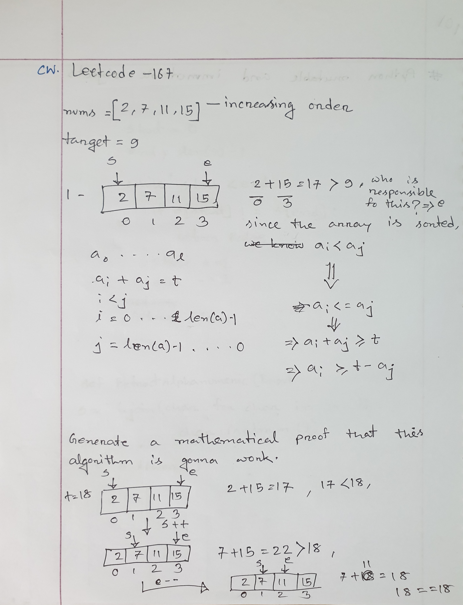
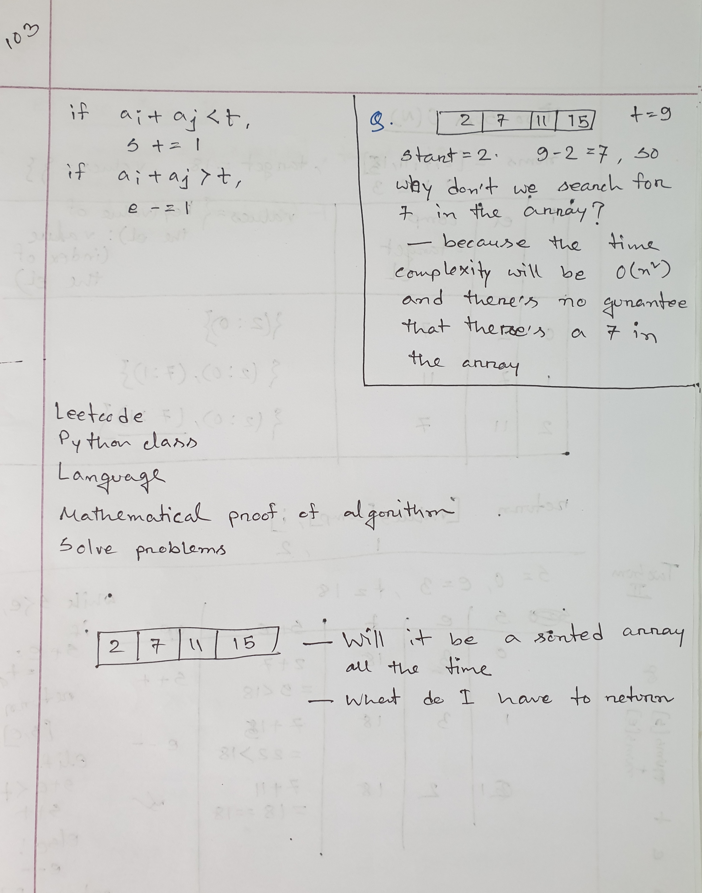

# Class 2

Everything in Python is an Object. When an object is created, it's given an **id** that points to the **memory address** of that object. Based on whether the value of an object can be changed or not, there are two type of objects in Python.

### 1. Mutable Objects

- Mutable objects are those whose values can be changed even though it has a pre assigned value.
- If the value of a mutable object is modified, the id of the object does not change.
- **list, set, dict** and **byte array** are mutable objects in python.
- If an immutable object is placed inside a mutable object, the values of the immutable object cannot be modified.

### 2. Immutable Objects

- Immutable objects are those whose values cannot be changed once it has been assgined.
- If the value of an immutable object is modified, the id of the object changes meaning a new object is created with the same name but different id. The first object that was created is unchanged.
- **int, float, complex, string, tuple, frozen set [note: immutable version of set]** and **bytes** are immutable objects in python.
- If a mutable object is placed inside an immutable object, the values of the mutable object can be modified without changing the immutable object.
- Although **dict** is a mutable object, the **key** property of a dict is immutable as keys of a dictionary should be unique.

### Class lectures

