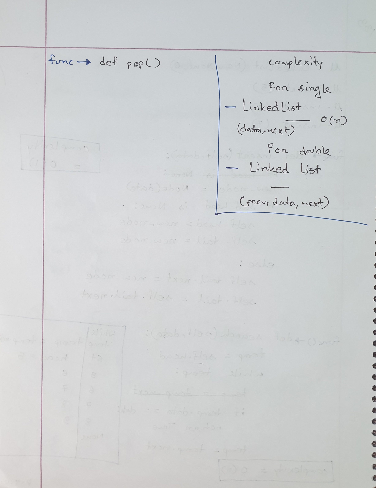

# Class 4

## Linked List

Linked list is a data structure where all the elements of a list
are linked. Each element has a reference of the memory address of
its following element or its previous element or both.

- **Singly Linked list** - Singly linked lists are lists where each 
element has a single pointer **next** that points to the next
element.

  

- **Doubly Linked list** - Doubly linked list elements contain an
extra **prev** pointer that points to the previous element of an 
element.

  

### Difference between "is" and "==" operator in python

"is" and "==" both are used for comparison purposes in python.
**"=="** compares the values of the objects where **"is"** compares 
whether both the objects have the same memory address.

### Usage of Linked lists in real life

- used in Kubernetes for packet matching
- used in Firewall
- used in caching layer of phones, web servers

### Class lectures

