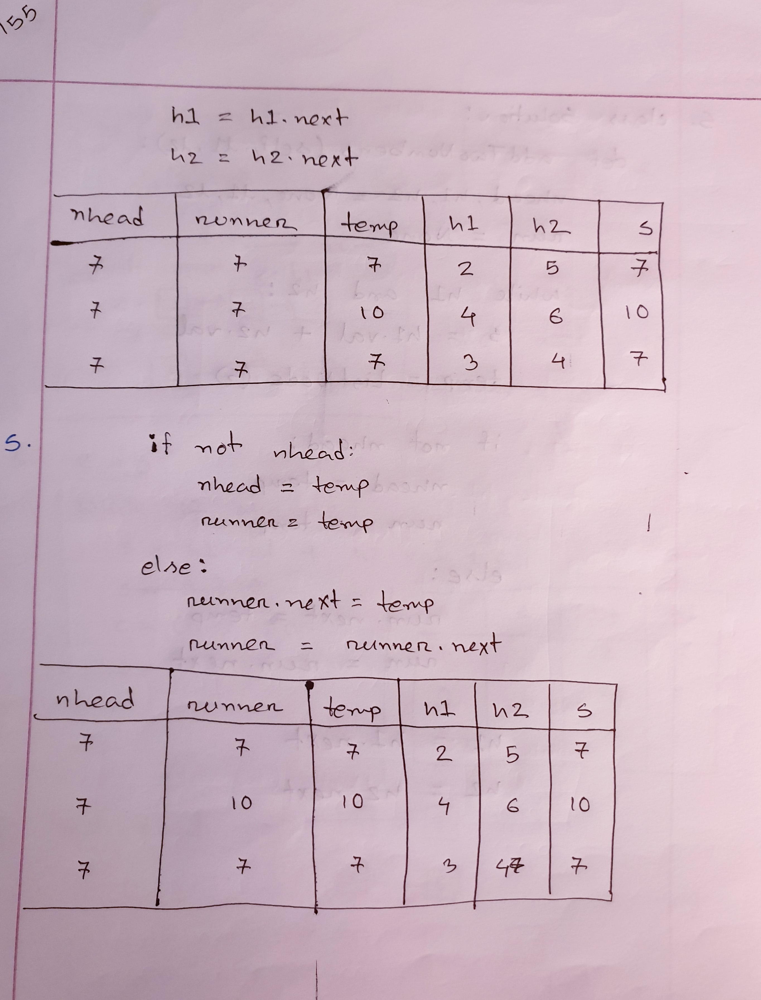
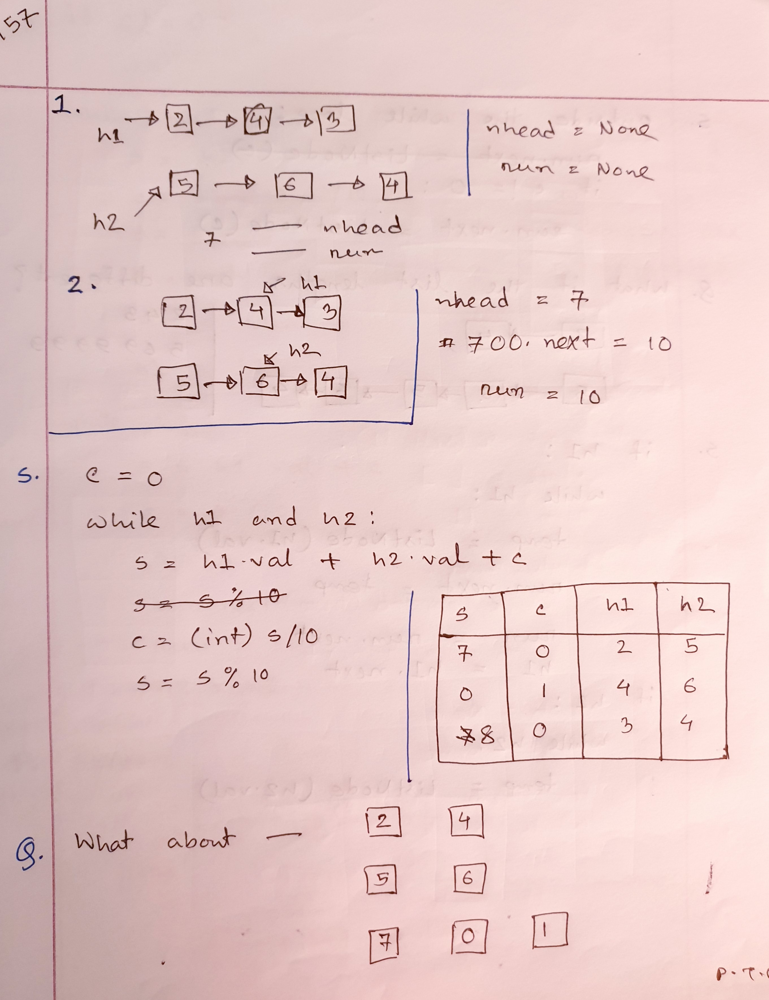
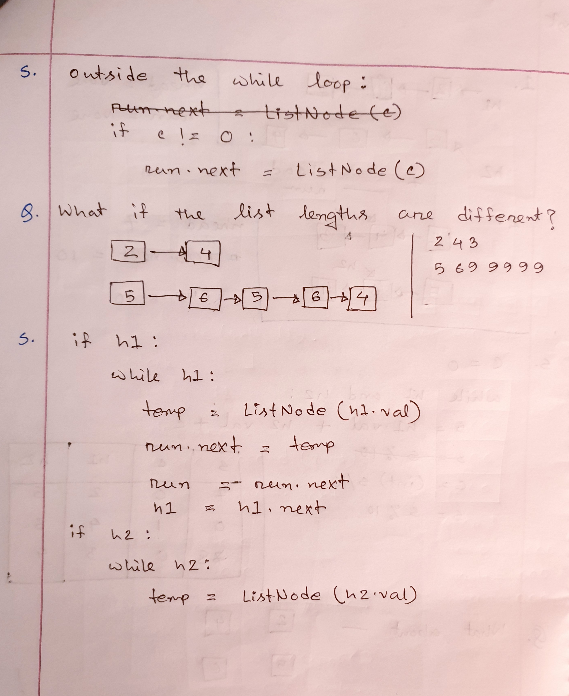
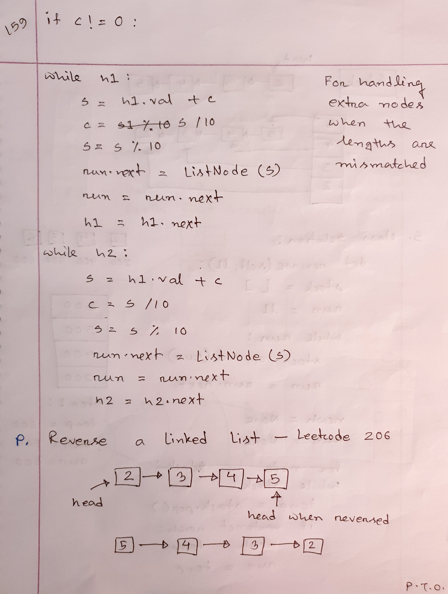
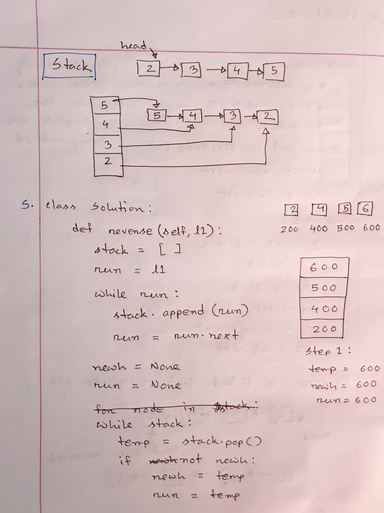
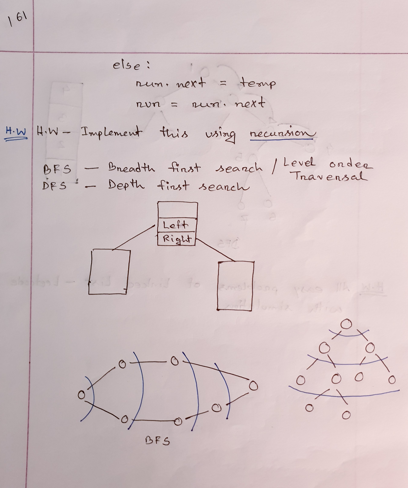
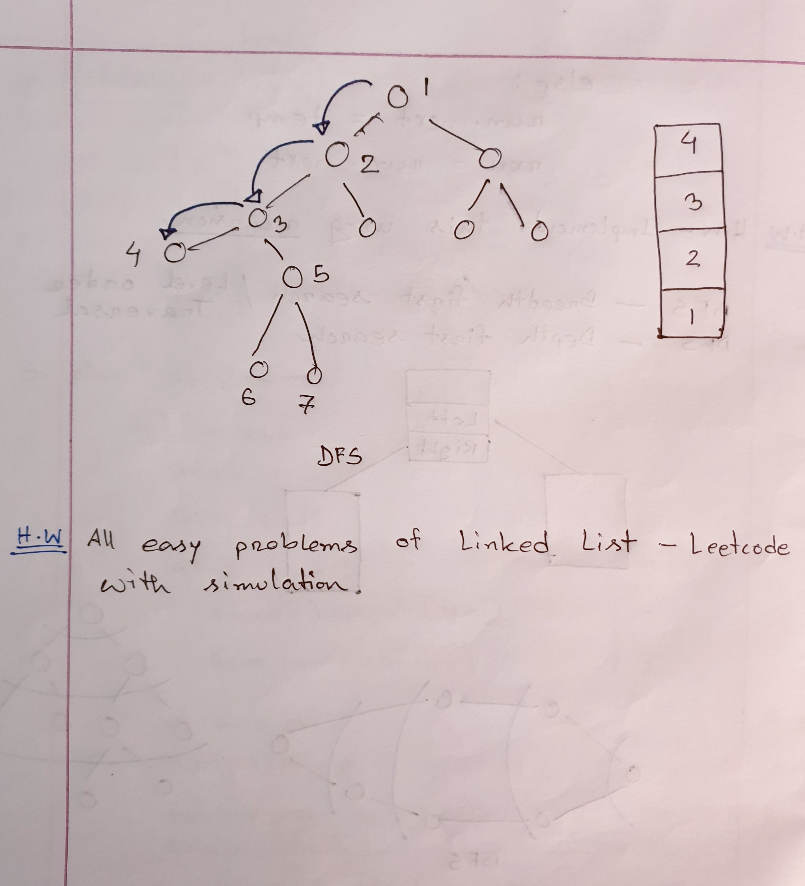

# Class 5

## Recursion

Recursion functions are functions that call itself repeatedly with a 
new parameter until a certain condition is fulfilled. The condition 
to stop a recursive function from calling itself is known as a base 
condition.

```py
def recursiveFunction(param):
    # base condition
    
    return recursiveFunction(param)
recursiveFunction(param)
```

The example of recursion can be a factorial function to find out the 
factorial an integer.


- Here, the base condition for the function is n == 1, meaning the 
function will stop calling itself when the value of n is 1.
- After the initial function call, the function calls itself 2 more 
times each time reducing the value of n by 1.
- It stops on the 2nd call as the value of n reaches 1 and returns 1.
- The 2nd call then returns 2*1 = 2 to the 1st call.
- Finally, the 1st call returns the value 3*2 = 6 to the initial call.
- As we can see, recursion always returns the values in a reverse order.

### Class Lectures











### References

[Python Recursion - Programiz](https://www.programiz.com/python-programming/recursion)